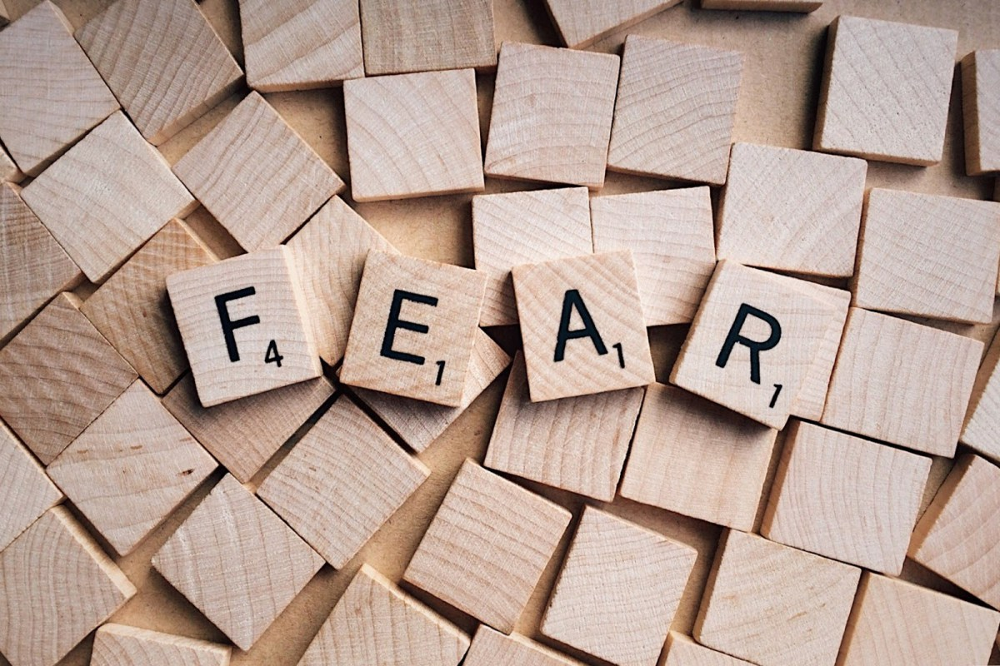

Have you seen the movie "InsideOut" (2015)? Let us resume the story. This film talks about Riley, a girl who has to move of her town with her parents to a new big city and starts to feel some emotional changes, even when she always used to be happy. 

In an ingenious and fun way, the movie shows us how our emotions control personality in children and adults, but specifically (and what interest us) the decisions we make every day. Yes, **sometimes you think that your mind is the one that makes the decisions but it turns out that in the end, it is your feelings that make you decided on something.** 

That is when we understand that emotional marketing becomes an ideal strategy, especially if your business is about products or services. In the words of Allie Decker, [emotional marketing](https://blog.hubspot.com/marketing/emotion-marketing?utm_campaign=Marketing%20Blog%20Weekly%20Email%20Sends&utm_source=hs_email&utm_medium=email&utm_content=65356979) "**refers to marketing and advertising efforts that primarily use emotion to make your audience notice, remember, share and buy.** Emotional marketing typically taps into a singular emotion, like happiness, sadness, anger or fear, to elicit a consumer response". 

Now you must be thinking about all the times you saw a commercial and it made you feel happy or sad, right? Probably, that car or that shirt made the person who was wearing it looks happy and then, you tried to buy it. Sorry, we have to tell you that you were influenced by emotional marketing.

But it's not a bad thing; **it's just a marketing strategy that, now that you know it, you will try to take advantage for your company, startup, brand or entrepreneurship**. So we recommended that you see Inside Out because it will give you some ideas on how our emotions determine our decisions.

<title-4>WHY USE EMOTIONS TO SELL?</title-4>

How many times do you buy ice cream because you feel sad? There is a [study from the London Institute of Psychiatry](https://www.clarin.com/ediciones-anteriores/prueban-comer-helado-hace-felices-personas_0_r1Jmsq_kAte.html) that shows that eating ice cream activates certain areas of the brain associated with pleasure and happiness. There is no way to check if this consequence was a real effect of the components of the ice cream or if it was just a marketing strategy of many many companies and brands that have sold us the idea that ice cream makes us happy. 

Or, in another example, when you watch a commercial of an airline that brings together a family that had not seen each other for years, you will feel sad if you feel identified with that scene. So when the moment comes, you will buy an airplane ticket on that airline to make yours that emotion. 

**When you achieve that your audience feels identified with your product you will increase the possibilities to purchase.** This is how emotional marketing works. But the real challenge is to recognize what your customers feel.

<title-4>IDENTIFY YOUR SEGMENT OR AUDIENCE</title-4>

When you create your marketing plan, you have to identify your audience, but this is when it will be very useful to you. **Be as specific as you can: gender, age, profession, work area, social class, interests, tastes...**all that things that we put to classify the client. 

Once you have that data, please, **take a long time to think what they feel: what makes them happy/sad/angry/afraid/surprised, what their fears are, what they want from their lives...**Put yourself in their feet. Only in that way you will know what are their emotions and will lead your marketing strategy that way." 

Allie Decker says that we can not aim for general "happiness"; it all depends on what feeling you intend to obtain. In some cases, generating sadness, hope or surprises in your audience you will get more purchases.

<block-quote>
<a href="https://blog.hubspot.com/marketing/emotion-marketing?utm_campaign=Marketing%20Blog%20Weekly%20Email%20Sends&utm_source=hs_email&utm_medium=email&utm_content=65356979">"Another way to measure your audience's emotional response to your marketing is to decipher how their emotions manifest as actions (...) Happiness typically leads to sharing, sadness leads to giving, fear leads to loyalty, and anger leads to virality".</a>
</block-quote>

<title-4>TALK ABOUT THEIR FEARS OR PROBLEMS</title-4>

You must think about how you can help your clients with their fears or wishes. **What can you offer them to alleviate or can you attend to their need?** All these things are so important for your communication with your client, through social media or other marketing and advertising channel. 

**Never start talking about your product in your conversation.** During the first few seconds, talk about their problems and all the benefits that the customer will obtain with your product or service. Describe why they are going to feel better. 

**Look and use familiar elements for your clients with whom may they feel identified.** But, also introduce new elements, like your product; make them understand what it is about, nothing complex or intricate. **Highlight the distinctive elements of your service** that make it different from other companies in your business sector. 

At the end of your speech, conversation, video, [storytelling](https://cobuildlab.com/blog/why-all-companies-should-use-storytelling) (actually, it is the most used and has a great projection) or any other content, **generate expectation about how the customer will feel when they buy your product or service**. Silence their fears and you will get their interest. 

You do not need a super audiovisual production to make your emotional marketing plan come true. There are many applications on the Internet to create videos or designs that you can use to talk to the audience about their feelings and sell your product. Therefore, join all this information about your clients and a good format to hook them.

