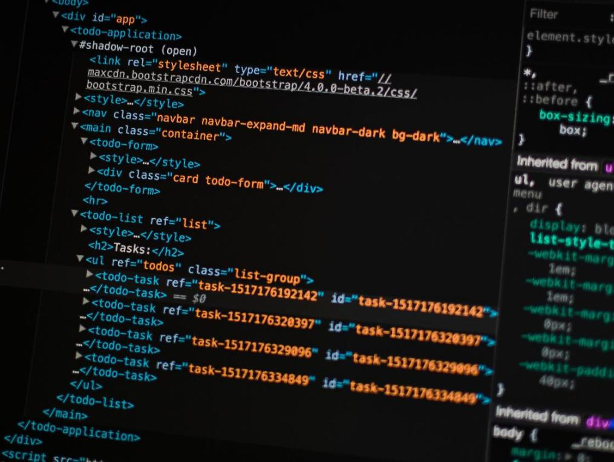
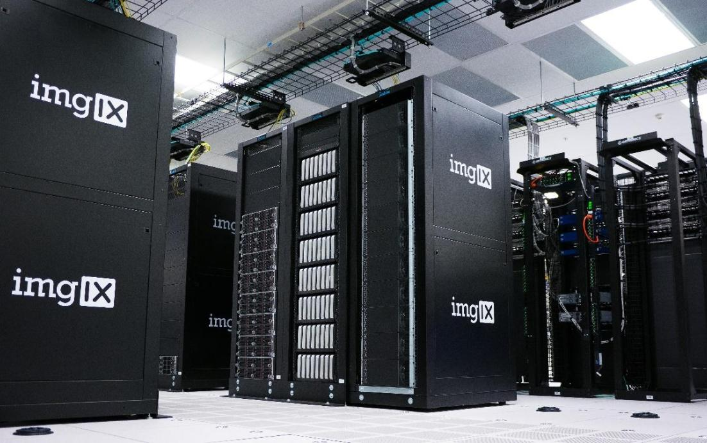

Currently, companies offering courses to students for those who want to **develop code skills** in different areas either front-end or back-end have increased. **Microsoft** is a company that wants people to join this wonderful world of coding, with a special focus on data science and artificial intelligence. Artificial intelligence is simply one of the most recent technologies that will help us produce more products and services with less work. 

The Microsoft Professional Program offers many **COURSES FREE**. The only requirement is to create or have a Microsoft account and edX since the courses will be dictated through this platform and so you can go at your own pace. Get real-world experience with these self-paced, online courses that feature hands-on demos, hands-on labs, and projects. 

Keep in mind that these are initiation courses, so will be a good option if you don't have much knowledge and you want to start acquiring them. All the courses have an introduction, development, applications and a final project. Browse the currently available tracks, explore those that interest you, and start learning right away. We give you the links to the web pages with the different courses offered so you can review them in detail and if you are interested, enroll now.  

<title-4>ENTRY LEVEL SOFTWARE DEVELOPMENT</title-4>

<credits>Photo by [Fabian Grohs](https://unsplash.com/photos/dC6Pb2JdAqs?utm_source=unsplash&utm_medium=referral&utm_content=creditCopyText) on [Unsplash](https://unsplash.com/search/photos/course?utm_source=unsplash&utm_medium=referral&utm_content=creditCopyText)</credits>

This curriculum is designed for those that have never attempted programming. You will learn how to think logically and systematically through creating basic programs, developing **interactive web pages**, and understanding how to keep the user in mind in design, as well as analyzing algorithms and data for efficiency. There are 13 sub-courses from 8 to 16 hours each. 

Link:[https://academy.microsoft.com/en-us/professional-program/tracks/entry-level-software-development/](https://academy.microsoft.com/en-us/professional-program/tracks/entry-level-software-development/)  

<title-4>CLOUD ADMINISTRATION</title-4>

Learn to work with **virtual machines**, **virtual networks** and **Azure services**, how to manage options, monitoring, customer's domains, security, and compliance. It has 11 sub-courses which take from 12 to 18 hours to complete each one. 

Link:[https://academy.microsoft.com/en-us/professional-program/tracks/cloud-administration/](https://academy.microsoft.com/en-us/professional-program/tracks/cloud-administration/)  

<title-4>DATA SCIENCE</title-4>

<credits>Photo by [Carlos Muza](https://unsplash.com/photos/hpjSkU2UYSU?utm_source=unsplash&utm_medium=referral&utm_content=creditCopyText) on [Unsplash](https://unsplash.com/search/photos/course?utm_source=unsplash&utm_medium=referral&utm_content=creditCopyText)</credits>

Learn to work and explore **data** using a variety of visualization, analytical, and statistical techniques. Companies hire data scientists to find insights and to solve meaningful business problems. It has 11 sub-courses which take from 8 to 12 hours to complete each one. 

Link: [https://academy.microsoft.com/en-us/professional-program/tracks/data-science/](https://academy.microsoft.com/en-us/professional-program/tracks/data-science/)  

<title-4>DEVOPS</title-4>

**DevOps** is the union of people, process, and products to enable continuous delivery of value to end users. Learn about continuous integration and deployment, infrastructure as code, testing, databases, containers, and application monitoring: skills necessary for a DevOps culture in your workplace. It has 9 sub-courses which take from 8 to 16 hours to complete each one. 

Link: [https://academy.microsoft.com/en-us/professional-program/tracks/devops/](https://academy.microsoft.com/en-us/professional-program/tracks/devops/)  

<title-4>BIG DATA</title-4>

<credits>Photo by [Samuel Zeller](https://unsplash.com/photos/vpR0oc4X8Mk?utm_source=unsplash&utm_medium=referral&utm_content=creditCopyText) on [Unsplash](https://unsplash.com/search/photos/microsoft?utm_source=unsplash&utm_medium=referral&utm_content=creditCopyText)
</credits>

Learn how to deploy, design, and load data using **Microsoft's Azure**. This curriculum takes students from their first statement of orchestrating big data workflows in the cloud. It has 10 sub-courses which take from 12 to 30 hours to complete each one. 

Link: [https://academy.microsoft.com/en-us/professional-program/tracks/big-data/](https://academy.microsoft.com/en-us/professional-program/tracks/big-data/)  

<title-4>FRONT-END WEB DEVELOPMENT</title-4>

<credits>Photo by [Pankaj Patel](https://unsplash.com/photos/u2Ru4QBXA5Q?utm_source=unsplash&utm_medium=referral&utm_content=creditCopyText) on [Unsplash](https://unsplash.com/search/photos/front-end-code?utm_source=unsplash&utm_medium=referral&utm_content=creditCopyText)</credits>

Learn the various technologies that computer programmers use when creating websites like HTML, CSS, and JavaScript, the web development on Angular. Students will learn, practice and prove they have the skills employers are looking for in a series of online courses with hands-on labs. It has 12 sub-courses which take from 15 to 30 hours to complete each one. 

Link: [https://academy.microsoft.com/en-us/professional-program/tracks/front-end-development/](https://academy.microsoft.com/en-us/professional-program/tracks/front-end-development/)  

<title-4>IT SUPPORT</title-4>

<credits>Photo by [imgix](https://unsplash.com/photos/klWUhr-wPJ8?utm_source=unsplash&utm_medium=referral&utm_content=creditCopyText) on [Unsplash](https://unsplash.com/search/photos/it-support?utm_source=unsplash&utm_medium=referral&utm_content=creditCopyText)</credits>

Expand your skills to become more effective and efficient troubleshooting including tricks on developing **analytical** solutions, best practices, how to manage customer expectations and handle customer objections to proposed solutions regardless of product. It has 14 sub-courses from 8 to 16 hours each. 

Link: [https://academy.microsoft.com/en-us/professional-program/tracks/it-support/](https://academy.microsoft.com/en-us/professional-program/tracks/it-support/)  

<title-4>ARTIFICIAL INTELLIGENCE</title-4>

**Learn **Python** and Maths. The AI takes aspiring **AI engineers** from a basic introduction of AI to mastery of the skills needed to build deep learning models for AI solutions that exhibit human-like behavior and intelligence. It has 10 sub-courses which take from 8 to 16 hours each.** 

Link: [https://academy.microsoft.com/en-us/professional-program/tracks/artificial-intelligence/](https://academy.microsoft.com/en-us/professional-program/tracks/artificial-intelligence/)  

<title-3>_You can work on these skills at the pace that is right for you._</title-3>

<credits>Photo by [Riccardo Annandale](https://unsplash.com/photos/7e2pe9wjL9M?utm_source=unsplash&utm_medium=referral&utm_content=creditCopyText) on [Unsplash](https://unsplash.com/search/photos/course?utm_source=unsplash&utm_medium=referral&utm_content=creditCopyText)</credits>

<title-3>We Hope You Enjoy!</title-3>